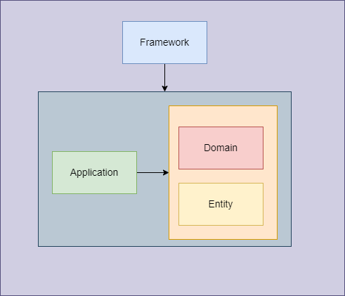

# Fastify with Hexagonal Architecture

Example API with [fastify](https://www.fastify.io/) following Hexagonal architecture.



### Entity
They are all those classes that model our domain, for example users, cart, orders, bone represents a concept of our context.

### Domain
There are all those rules about our business.

### Application
This is where we store or execute business logic.

### Framework
They are all the components outside our business logic, such as database technologies, libraries, frameworks.

## Features
* typescript
* [knexjs](https://knexjs.org/) and [Objection.js](https://vincit.github.io/objection.js/) for database
* nodemon
* eslint
* prettier
* husky

## Project Structure
```
src\
 |--**\                                 # Uses cases or entities name
 |--**\application\**.ts                # Business logic (service layer)
 |--**\domain\**.ts                     # Domain Definitions
 |--**\entity\**.ts                     # Entity interface
 |--**\framework\**.controller.ts       # Route controllers
 |--**\framework\**.db.ts               # DB setup for entity
 |--**\framework\**.implementation.ts   # Framework Implementation of Domain
 |--**\framework\**.router.ts           # Route Fastify
 |--shared\**.ts                        # Utilities or Functions shared between components 
 |--server/server.ts                    # Fastify app
 |--index.ts                            # App entry point
```

### Why uses cases are in root `src`
The goal is have structure clean to see and recognize easily what uses case we have in our project putting the use cases at the top level being easy to understand where we should handle them.